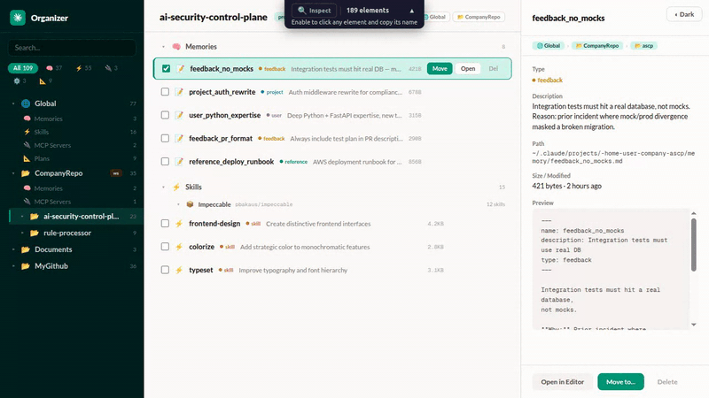

# UI Annotator MCP

[](https://www.npmjs.com/package/@mcpware/ui-annotator)
[](https://www.npmjs.com/package/@mcpware/ui-annotator)
[](LICENSE)
[](https://github.com/mcpware/ui-annotator-mcp)
[](https://github.com/mcpware/ui-annotator-mcp/fork)

**English** | [廣東話](README.zh-HK.md)

**Bridge the gap between what you see and what AI can reference — in any browser, zero extensions.**

The only tool that puts visible labels on every web element. Hover any element, see its name. Tell your AI assistant "make the `sidebar` wider" — it knows exactly which element you mean. No screenshots, no CSS selectors, no miscommunication.



## Why It Matters

Dramatically improves AI-driven UI design and iteration. The pain: telling AI "move that button next to the search bar" never works because the AI can't see your page. UI Annotator fixes this — hover over any element and its component name appears as a label. Now you say "move `SearchButton` below `NavBar`" and Claude edits the right component instantly. No browser extensions, works with any framework. The workflow becomes: open page → hover to identify elements → describe changes using real component names → Claude edits → refresh and repeat. Turns a frustrating back-and-forth into a fluid design loop.

## The Problem

When reviewing a web UI with an AI coding assistant, the hardest part isn't the code change — it's **describing which element you want changed**.

> "That thing on the left... the second row... no, the one with the icon..."

You don't know what it's called. The AI doesn't know what you're pointing at. You waste time on miscommunication instead of shipping.

## The Solution

Open your page through the annotator proxy. Hover any element — instantly see its name, CSS selector, and dimensions. Now you both speak the same language.

```
# Start the MCP server
npx @mcpware/ui-annotator

# Open in ANY browser
http://localhost:7077/localhost:3847
```

**That's it.** No browser extensions. No code changes. No setup. Works in Chrome, Firefox, Safari, Edge — any browser.

## How It Works

```
Your app (localhost:3847)
        │
        ▼
┌─────────────────────┐
│  UI Annotator Proxy  │ ← Reverse proxy on port 7077
│  (MCP Server)        │
└─────────────────────┘
        │
        ▼
Proxied page with hover annotations injected
        │
        ├──► User sees: hover overlay + tooltip with element names
        └──► AI sees: structured element data via MCP tools
```

The proxy fetches your page, injects a lightweight annotation script, and serves it back. The script scans the DOM, identifies named elements, and reports them to the MCP server. Your AI assistant queries the server to understand what's on the page.

## Features

### Hover Annotations
Hover any element to see:
- **Element name** (pink) — the human-readable identifier
- **CSS selector** (monospace) — the technical reference
- **Content preview** — what text the element contains
- **Dimensions** — width × height in pixels

### Inspect Mode
Click the **Inspect** button in the toolbar (or let your AI toggle it). In inspect mode:
- Click any element → **copies its name to clipboard**
- All page interactions are paused (clicks don't trigger buttons/links)
- Click Inspect again to return to normal mode

### Collapsible Toolbar
The toolbar sits at the top center of the page showing:
- Inspect toggle button
- Element count
- Helpful subtitle explaining what to do
- Collapse button (▲) to minimize when not needed

### MCP Tools for AI
| Tool | What it does |
|---|---|
| `annotate(url)` | Returns proxy URL for user to open in any browser |
| `get_elements()` | Returns all detected UI elements with names, selectors, positions |
| `highlight_element(name)` | Flash-highlights a specific element so user can confirm |
| `rescan_elements()` | Force DOM rescan after page changes |
| `inspect_mode(enabled)` | Toggle inspect mode remotely |

## Why Not Just Use DevTools?

|  | Browser DevTools | UI Annotator |
|---|---|---|
| **Target user** | Frontend developers who know the DOM | Anyone — QA, PM, designer, junior dev |
| **Learning curve** | Need to understand DOM tree, CSS selectors, box model | Hover and read — zero learning |
| **Communication** | "The `div.flex.gap-4` inside the second child of..." | "The `sidebar`" |
| **Language** | CSS/HTML technical terms | Human-readable names |
| **Setup** | Teach people to open DevTools + navigate the DOM | Open a URL |
| **AI integration** | None — AI can't see what you're inspecting | MCP — AI sees the same element names you do |

**DevTools is for debugging.** UI Annotator is for **communication** — giving humans and AI a shared vocabulary for UI elements.

## Why Not Use Existing Tools?

None of these do what UI Annotator does — **live visual labels on every element via reverse proxy**:

| Tool | Approach | Why we're different |
|---|---|---|
| **browser-use** (82K⭐) | AI automation framework | Automates browsers, doesn't label elements for humans. Different use case entirely. |
| **Chrome DevTools MCP** (31K⭐) | DOM snapshot + element UIDs | AI can inspect, but humans don't see visual annotations. No shared vocabulary. |
| **Playwright MCP** (29K⭐) | Accessibility tree snapshot | Returns structured text, no visual overlay. Truncates important context. |
| **OmniParser** | Screenshot + CV detection | Screenshot-based, not live DOM. ~40% accuracy on hard benchmarks. |
| **MCP Pointer** (526 users) | Chrome extension + MCP | Requires Chrome extension. Human clicks to select — no hover overlay. |
| **Agentation** | npm embedded in your app | Requires code changes. React 18+ dependency. Not zero-config. |
| **Vibe Annotations** | Chrome extension | Extension-based, developer-only annotation workflow. |

### Feature Comparison

| Feature | UI Annotator | MCP Pointer | Agentation | Cursor | Chrome DevTools MCP |
|---|---|---|---|---|---|
| Visual hover annotation | **Yes** | No | Partial | Yes (IDE only) | No |
| Shows element names | **Yes** | Yes | Yes | No (high-level) | Programmatic |
| Shows dimensions | **Yes** | Yes | Yes (Detailed) | Yes | Programmatic |
| MCP server | **Yes** | Yes | Yes | No | Yes |
| Zero browser extensions | **Yes** | No | Yes | N/A | No |
| Zero code changes | **Yes** | Yes | No | N/A | Yes |
| Any browser | **Yes** | Chrome only | Desktop only | Cursor only | Chrome only |
| Zero dependencies | **Yes** | Chrome ext | React 18+ | Cursor | Chrome |
| Click to copy element name | **Yes** | No | No | No | No |

## Architecture

### Zero external dependencies
- **Reverse proxy**: Node.js built-in `http` module
- **MCP server**: `@modelcontextprotocol/sdk` (stdio transport)
- **Communication**: HTTP POST (browser → server) + GET polling (server → browser)
- **No WebSocket, no Express, no browser extension**

### How the proxy works
1. User requests `localhost:7077/localhost:3847`
2. Proxy fetches `http://localhost:3847`
3. For HTML responses:
   - Injects `fetch()` / `XMLHttpRequest` interceptor (rewrites API paths through proxy)
   - Rewrites `href="/..."` and `src="/..."` attributes to route through proxy
   - Injects annotation script before `</body>`
4. For non-HTML (CSS, JS, images): passes through directly
5. Strips `Content-Security-Policy` headers to allow injected script

### How annotation works
1. Script scans DOM for elements with `id`, `class`, semantic roles, or interactive roles
2. On hover: positions overlay border (follows `border-radius`) + positions tooltip (always within viewport)
3. Reports all detected elements to server via `POST /__annotator/elements`
4. Polls `GET /__annotator/commands` every second for server instructions (highlight, rescan, inspect toggle)
5. `MutationObserver` auto-rescans when DOM changes

## Quick Start

### With Claude Code
```bash
# Add as MCP server
claude mcp add ui-annotator -- npx @mcpware/ui-annotator

# Then in conversation:
# "Annotate my app at localhost:3847"
# → AI returns proxy URL, you open it, hover elements, discuss changes by name
```

### Manual
```bash
npx @mcpware/ui-annotator
# Proxy starts on http://localhost:7077
# Open http://localhost:7077/localhost:YOUR_PORT
```

### Environment Variables
| Variable | Default | Description |
|---|---|---|
| `UI_ANNOTATOR_PORT` | `7077` | Port for the proxy server |

## More from @mcpware

| Project | What it does | Install |
|---------|---|---|
| **[Instagram MCP](https://github.com/mcpware/instagram-mcp)** | 23 Instagram Graph API tools — posts, comments, DMs, stories, analytics | `npx @mcpware/instagram-mcp` |
| **[Claude Code Organizer](https://github.com/mcpware/claude-code-organizer)** | Visual dashboard for Claude Code memories, skills, MCP servers, hooks | `npx @mcpware/claude-code-organizer` |
| **[Pagecast](https://github.com/mcpware/pagecast)** | Record browser sessions as GIF or video via MCP | `npx @mcpware/pagecast` |
| **[LogoLoom](https://github.com/mcpware/logoloom)** | AI logo design → SVG → full brand kit export | `npx @mcpware/logoloom` |
## License

MIT
